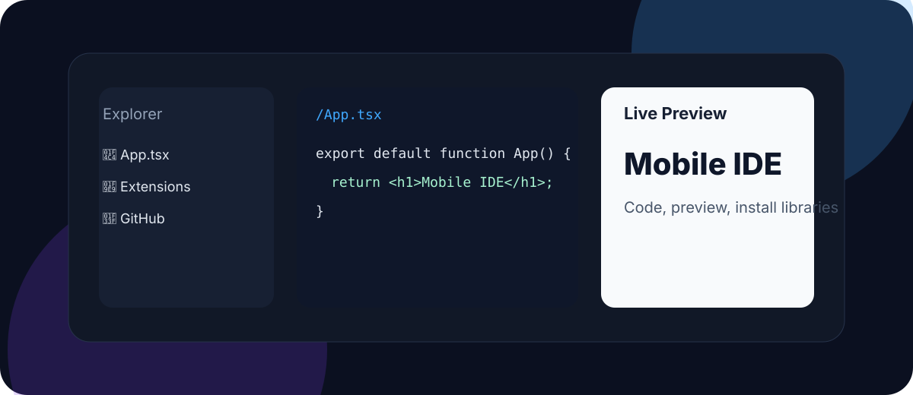
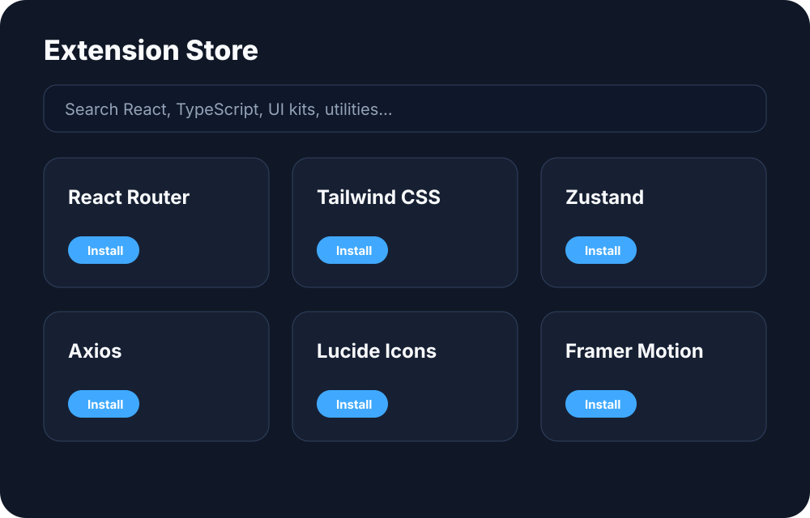

<p align="center">
  
</p>

<h1 align="center">Mobile Sandbox IDE</h1>

<p align="center">
  VS Code-style mobile web IDE for editing, previewing, installing libraries and syncing code from your phone.
</p>

<p align="center">
  <a href="LICENSE"></a>
  
  
  
  
</p>

<p align="center">
  
</p>

## ✨ Tính năng chính

| Nhóm | Tính năng |
| --- | --- |
| IDE mobile | Files, Code, Preview, Git, Settings và Extension Store dạng tab giống VS Code. |
| Marketplace | Tìm kiếm, cài/gỡ nhiều thư viện như React Router, Tailwind CSS, Zustand, Axios, Lucide React, Framer Motion. |
| Runtime | Sandpack chạy preview trực tiếp trong browser và nhận dependencies đã cài từ store. |
| Productivity | Quick Keys Toolbar, autosave `localStorage`, export project JSON. |
| GitHub | Tạo OAuth URL, lấy profile, tạo repo và push file qua GitHub REST API. |
| Deploy | Logo SVG, CNAME, security headers, hướng dẫn domain/DNS cho IDE và Docs. |

## 🧩 Extension Store

<p align="center">
  
</p>

Extension Store hoạt động như một marketplace nhỏ trong IDE:

1. Mở tab **extensions**.
2. Tìm thư viện theo tên package, danh mục hoặc mô tả.
3. Bấm **Cài đặt** để thêm package vào Sandpack dependencies.
4. Bấm **Đã cài - Gỡ** để xóa package khỏi workspace.

Danh sách package đã cài được lưu trong `localStorage` để lần sau mở lại vẫn còn cấu hình.

## 🗂️ Cấu trúc thư mục

```text
mobile-sandbox-ide/
├── apps/
│   ├── ide/                  # Mobile IDE app
│   │   ├── public/            # logo.svg, CNAME, _headers
│   │   └── src/               # App, styles, services, tests
│   └── docs/                 # Documentation app
├── assets/                   # SVG logo, hero, screenshots, sponsor art
├── docs/                     # Domain/DNS operations docs
├── package.json              # npm workspaces scripts
└── tsconfig.base.json        # shared TypeScript config
```

## 🚀 Cài đặt local

```bash
npm install
npm run dev:ide
npm run dev:docs
```

## ✅ Kiểm thử và build

```bash
npm run typecheck
npm run test
npm run build
```

## 🔐 GitHub OAuth

Tạo GitHub OAuth App và khai báo biến môi trường:

```bash
VITE_GITHUB_CLIENT_ID=your_github_oauth_client_id
```

> Không commit `GITHUB_CLIENT_SECRET` vào frontend. Nếu cần đổi OAuth `code` sang access token, hãy triển khai serverless callback riêng.

## 🌐 Domain và DNS

Domain mẫu:

- IDE: `ide.mobile-sandbox.example.com`
- Docs: `docs.mobile-sandbox.example.com`

Xem chi tiết trong [`docs/domain-and-dns.md`](docs/domain-and-dns.md). Repo đã có `CNAME` và `_headers` cho cả IDE và Docs; hãy thay domain mẫu bằng domain thật trước khi deploy production.

## 🤝 Tài trợ

<p align="center">
  
</p>

Bạn có thể thêm logo nhà tài trợ bằng cách cập nhật `assets/brand/sponsors.svg` hoặc thay bằng file SVG sponsor wall riêng.

## 📦 Deploy nhanh

1. Chạy `npm run build`.
2. Deploy `apps/ide/dist` và `apps/docs/dist` lên Cloudflare Pages/Vercel.
3. Trỏ DNS theo bảng trong `docs/domain-and-dns.md`.
4. Cập nhật GitHub OAuth callback URL theo domain production.
5. Kiểm tra CSP/security headers sau khi deploy.

## 📄 License

AGPL-3.0 — xem [`LICENSE`](LICENSE).
